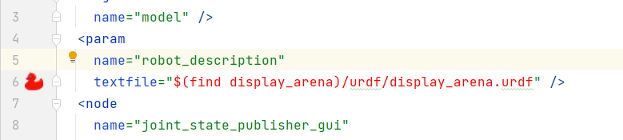
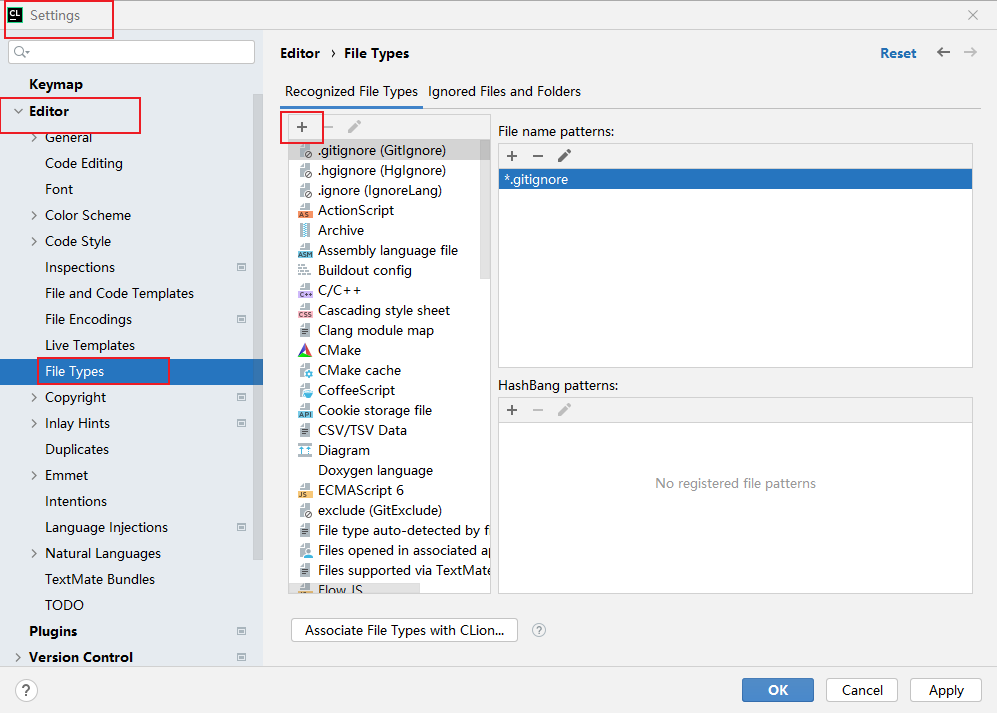
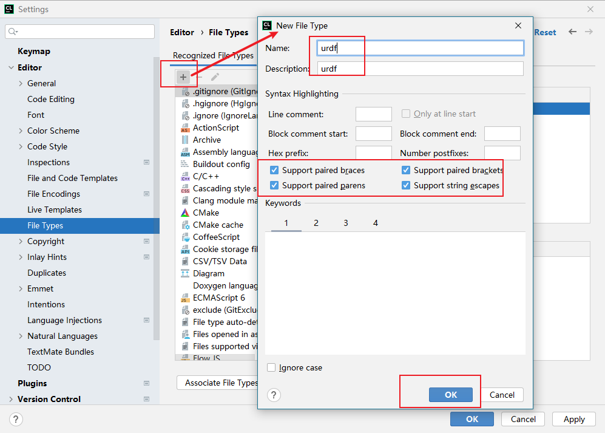
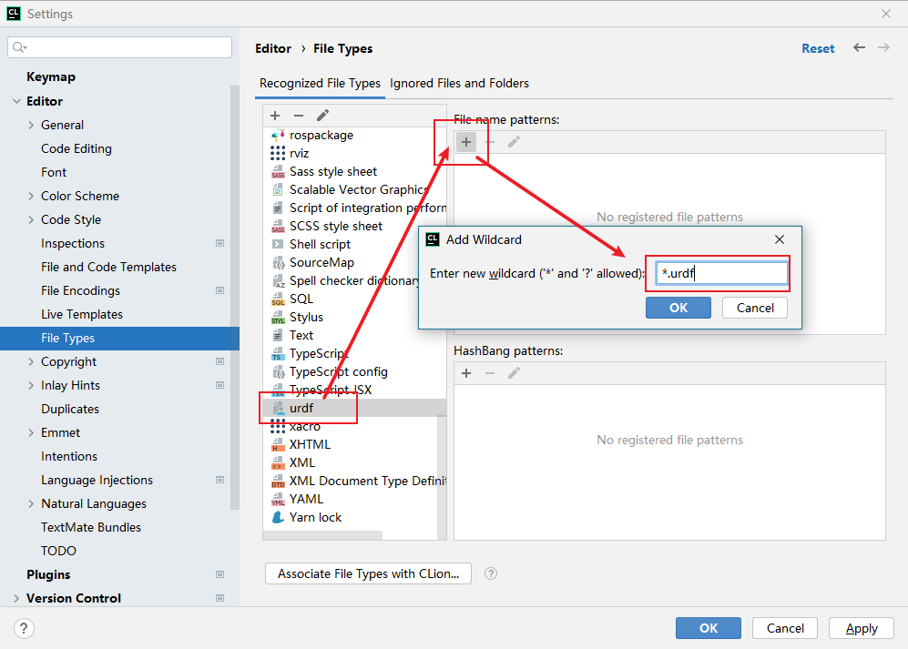

> 前言
> JetBrains的软件表现一直比较不错，在用Clion开发stm32时也比较舒服。最近在做ROS开发时，尝试用Clion开发ROS，出现了识别不出urdf文件的错误。

其他文件的识别是通过安装了插件后自动实现的，对urdf需要单独添加，语言高亮就没必要了，因为我是用solidworks导出的，所以能识别到就好。

1. 首先在设置中找到文件类型，并点击加号添加文件类型，如下图。

2. 点击加号后添加urdf文件内容，下图供参考

3. 在上一步完成后，在列表中找到urdf，按箭头顺序依次填写内容

4. 返回launch文件就能看到可以找到urdf文件了