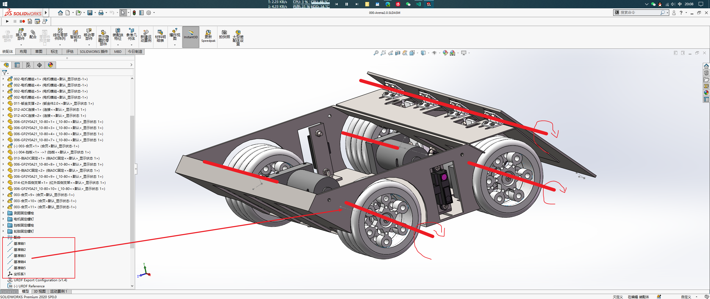
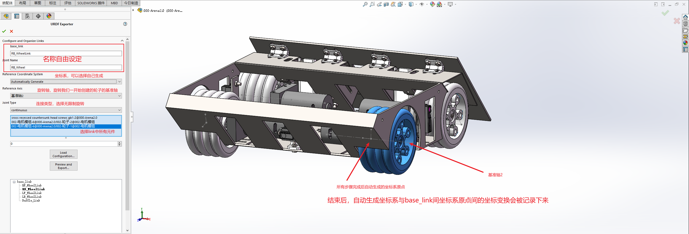
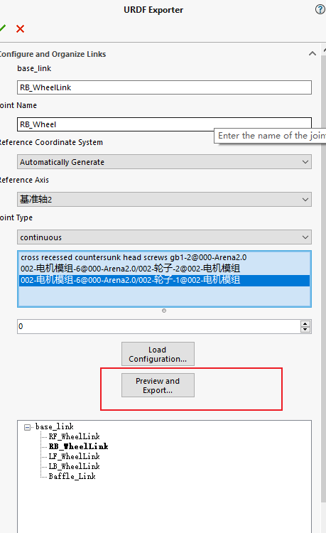
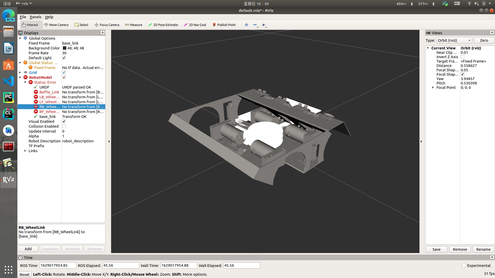

> 环境说明：solidworks2020、Ubuntu18.04、ROS-melodic

# 一、 建模

建模时需注意以下几点
1. 机器人要有一个base_link，为其设置一个坐标原点。我的作图习惯是将base_link在装配时就定义到坐标原点，这样可以直接选用坐标原点设置为base_link的坐标原点。
2. 为需要旋转的部分设置一个旋转轴，例如下图中机器人的四个轮子和前面的挡板应该是要转动的，所以在其各自旋转轴中设置旋转轴。
 
 

 
 

# 二、 插件安装
[solidworks_urdf_exporter](https://github.com/ros/solidworks_urdf_exporter/releases)
下载其中exe文件安装即可

# 三、 solidwoks中导出urdf

1. 在**工具->Tools->Export as URDF**中打开刚才安装的sw2urdf工具。或者直接在右上角搜索框输入urdf，比较方便。
2. 设置base_link。修改途中与base_link相连link个数时会在下方创建Empty_link，由于我已经修改过了，所以名称不一样。

3. 设置每个单独的link。在上图框中五个link中选中就会进入每个单独link的设置过程。这里每个link设置就一样了，以一个轮子为例。

这里的joint类型说明一下：
   + revolute：旋转关节，可设定转动范围
   + continuous：旋转关节，无位置限制
   + prismatic：滑动关节，有位置限制
   + fixed：虚拟关节，不可运动
   + floating：六自由度关节
   + planar：平面关节

4. 根据以上步骤设置完所有关节后，开始导出文件。选中下图框中Preview and Export，会自动计算数据，并生成预览。检查没问题后，按照引导导出文件就好。

+ **命名时有个问题需要注意一下**：这里的命名内容包括**小写字母、下划线、数字**，否则在ROS中需要改相当一部分内容的名字，这里最好一步到位。

+ 其实这里的建模，最好不要把一些螺栓、螺钉、固定板等比较杂的零件放进去，计算速度会慢，找到主要的主体、传感器、轮子等就好。

# 四、 ros中显示

1. 创建工作空间
2. 将上一步solidworks插件生成的功能包复制到工作空间的src目录下。
3. 修改功能包的以下几个地方：
   + package.xml中的邮箱，可以设置个自己的
   + display.launch中添加一行代码`<node pkg="joint_state_publisher" type="joint_state_publisher" name="joint_state_publisher">`。~~因为自动生成的launch文件使用joint_state_publisher_gui，在rviz中出现节点间没有坐标变换的情况~~，如下图
   

**这里修正一下：**
joint_state_publisher_gui不是不发布坐标变换信息，而是又可能没有安装这个包
`sudo apt-get install ros-melodic-joint-state-publisher-gui`

4. 最终使用roslaunch在rviz模型中显示，如下图。
  