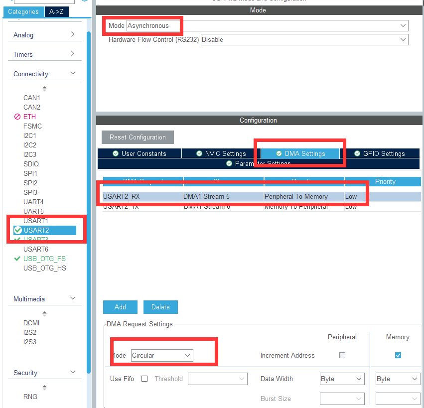

---
title: IMU-JY901
date: 2022-04-07 21:16:37
categories: 
	[STM32]
tags: 
	[STM32,ROS]
typora-root-url: ..\..
---

# STM32：串口空闲中断 + DMA读取

## 1. CubeMX配置

配置如下图，注意RX的DMA配置为Circular，即循环模式，这样可以保证接收到的数据不会丢失。TX可以为Normal，即非循环模式。


## 2. 定义相关结构体

```c
typedef struct {

	short acc[3];
	short gyro[3];
	short angle[3];
	short quat[4];
} JY901_Data;

#define BUFFER_SIZE     255

typedef struct {
	
	//DMA+空闲中断用参数
	uint8_t receive_buff[BUFFER_SIZE];
	uint8_t data_length;

} UARTParams_TypeDef;

```

## 2. 使能空闲中断与DMA接收

这段要在main函数对串口初始化之后，wihle(1)循环之外。

```C
// 使能空闲中断
USART2->CR1 |= USART_CR1_IDLEIE;
// 使能DMA接收
USART2->CR3 |= USART_CR3_DMAR;

// HAL库形式
__HAL_UART_ENABLE_IT(&huart2, UART_IT_IDLE);
HAL_UART_Receive_DMA(huart, (uint8_t *) UART_Params.receive_buff, BUFFER_SIZE);

```
## 3. 中断函数

在stm32f4xx_it.c文件中找到串口中断，添加自定义的DMA中断函数
```C
void USART2_IRQHandler(void)
{
  /* USER CODE BEGIN USART2_IRQn 0 */

  /* USER CODE END USART2_IRQn 0 */
  HAL_UART_IRQHandler(&huart2);
  /* USER CODE BEGIN USART2_IRQn 1 */

	myuart_DMA(&huart2);

  /* USER CODE END USART2_IRQn 1 */
}
```
```c
void myuart_DMA(UART_HandleTypeDef *huart) {

	if (huart->Instance == USART2) {
		if (RESET != __HAL_UART_GET_FLAG(huart, UART_FLAG_IDLE))  //判断是不是串口空闲中断
		{
			__HAL_UART_CLEAR_IDLEFLAG(huart);                      //清楚串口空闲中断标志
			
			HAL_UART_DMAStop(huart);

			UART_Params.data_length = BUFFER_SIZE - __HAL_DMA_GET_COUNTER(huart->hdmarx);

//			HAL_UART_Transmit(huart, (uint8_t *) UART_Params.receive_buff, IMU_Data.data_length, 0x200);

			JY901_Read(UART_Params.receive_buff, IMU_Data);

			memset(UART_Params.receive_buff, 0, UART_Params.data_length);
			UART_Params.data_length = 0;

			HAL_UART_Receive_DMA(huart, (uint8_t *) UART_Params.receive_buff, BUFFER_SIZE);
		}
	}
}

```

## 4. IMU-JY901数据解析

注意数据的解析，每次接收到的数据包是在上位机配置的全部数据，所以要注意解析不同数据时的	顺序。

```C
//	JY901数据结构
//       xL xH yL yH zL zH TL TH SUM
// 0  1  2  3  4  5  6  7  8  9  10
// 55 51 53 FA F0 04 C4 01 C6 07 79		加速度
//
//       xL xH yL yH zL zH TL TH SUM
// 11 12 13 14 15 16 17 18 19 20 21
// 55 52 7E E6 14 FD 28 04 C6 07 15		角速度

//       RL RH PL PH YL YH VL VH SUM
// 22 23 24 25 26 27 28 29 30 31 32
// 55 53 03 42 7E 16 9C 40 0E 29 94		角度

//       0L 0H 1L 1H 2L 2H 3L 3H SUM
// 33 34 35 36 37 38 39 40 41 42 43
// 55 59 96 4D 78 2D 6D 50 C0 2A DD		四元数
```

```c
void JY901_Read(uint8_t *receive_buff, JY901_Data imu_data) {

	if (receive_buff[0] == 0x55) {
		// 解析加速度
		if (receive_buff[1] == 0x51) {
			memcpy(&IMU_Data.acc, &receive_buff[2], 8);
		}
		// 解析角速度
		if (receive_buff[12] == 0x52) {
			memcpy(&IMU_Data.gyro, &receive_buff[13], 8);
		}
		// 解析角度
		if (receive_buff[23] == 0x53) {
			memcpy(&IMU_Data.angle, &receive_buff[24], 8);
		}
		// 解析四元数
		if (receive_buff[34] == 0x59) {
			memcpy(&IMU_Data.quat, &receive_buff[35], 8);
		}
	}
}

```