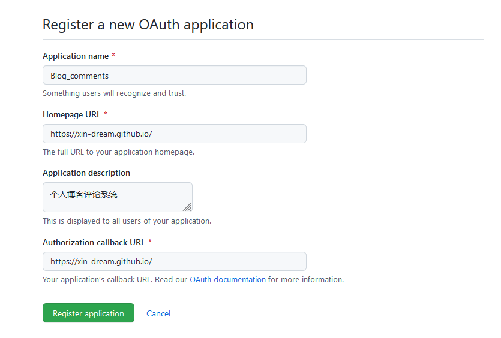
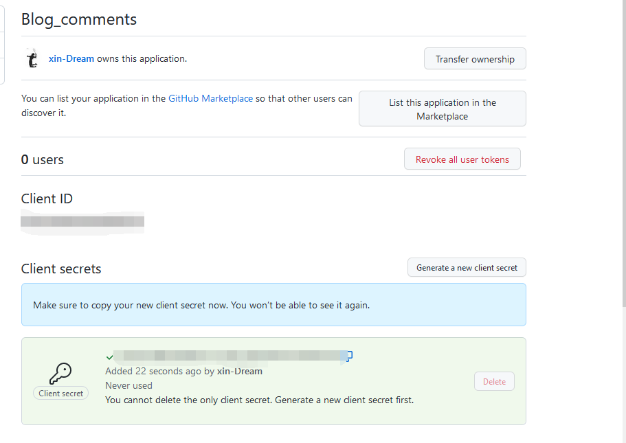
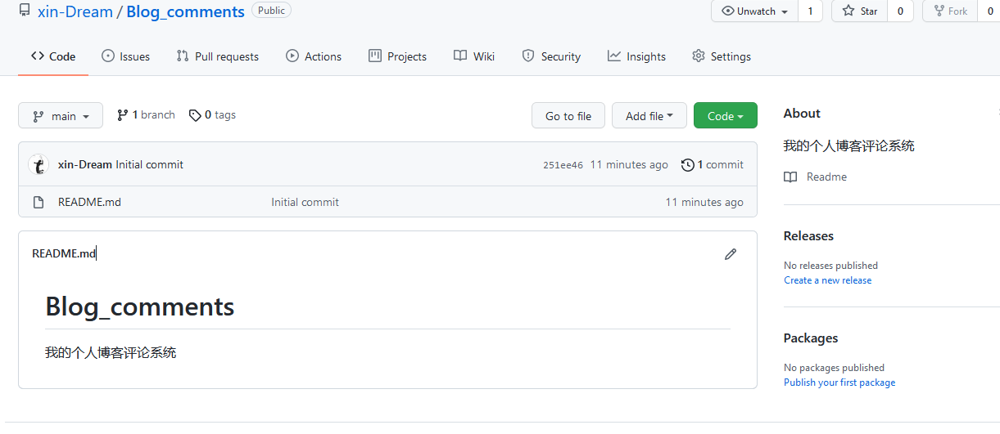

# 创建评论系统的repository



# 在GitHub上注册新应用

[应用注册界面](https://github.com/settings/applications/new)



在注册结束后，可以看到如下信息





# 在hexo博客中填写gitalk信息

将上面的Client ID和Client secrets及其他信息填入到博客主题的信息设置中

```bash
gitalk:
  enable: false # true
  clientID:  # GitHub Application Client ID
  clientSecret:  # Client Secret
  repo: Blog_comments  # Repository name
  owner: xin-Dream # GitHub ID
  admin: xin-Dream # GitHub ID

```
# 注意事项

使用gitalk评论系统后，发布的文章需要由管理者进入初始化后才能开启评论。


