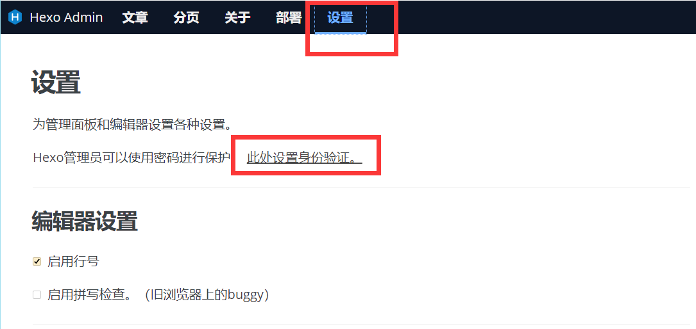
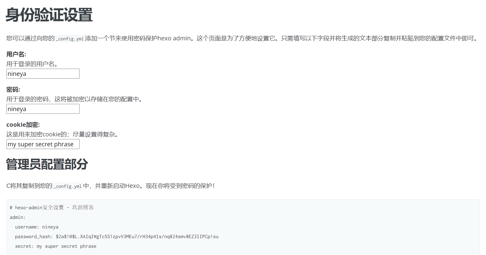
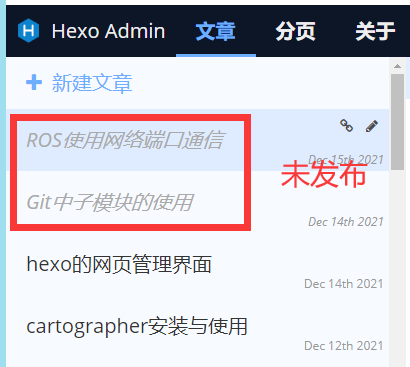
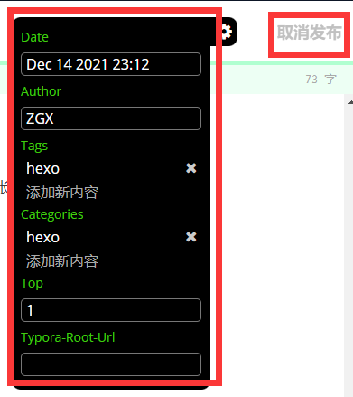
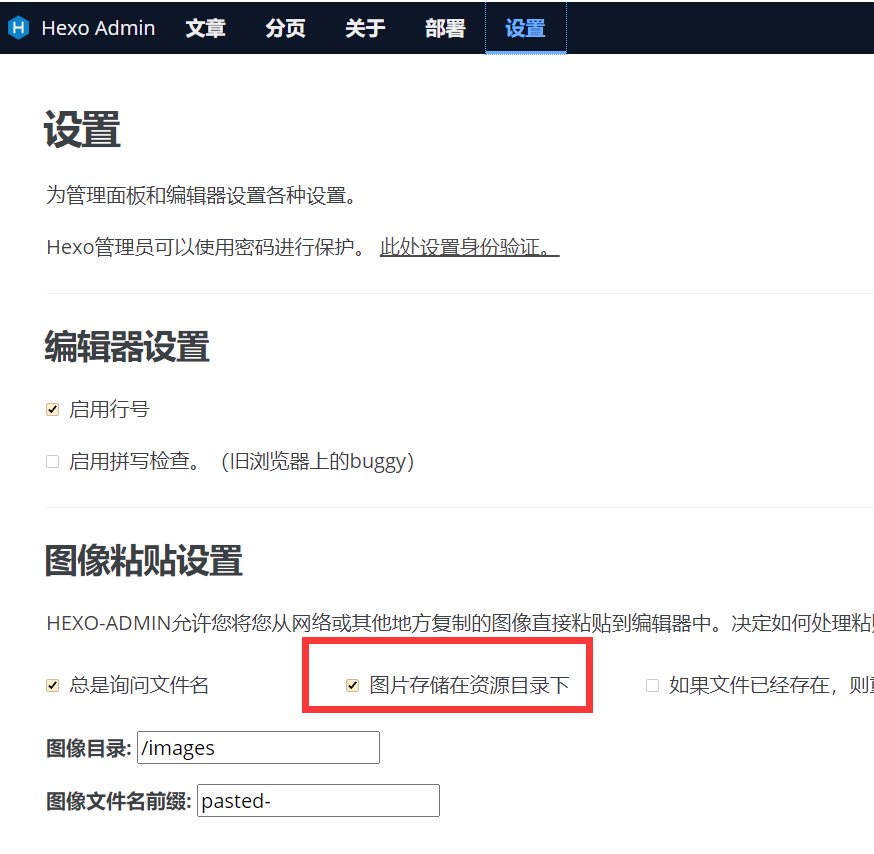
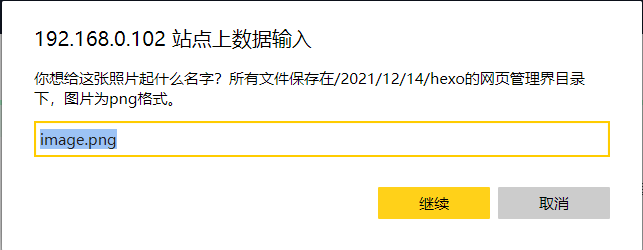
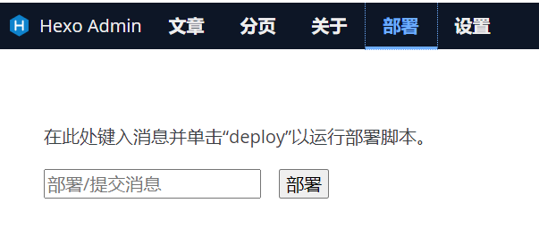

# 0. 参考
+ [hexo博客使用hexo-admin插件管理文章](https://blog.csdn.net/nineya_com/article/details/103380243?spm=1001.2101.3001.6650.6&utm_medium=distribute.pc_relevant.none-task-blog-2~default~BlogCommendFromBaidu~default-6.nonecase&depth_1-utm_source=distribute.pc_relevant.none-task-blog-2~default~BlogCommendFromBaidu~default-6.nonecase)
+ [hexo-admin插件windows系统插入图片失败问题解决](https://blog.csdn.net/nineya_com/article/details/103384546)

# 1. 功能简介

网页管理界面通过hexo-admin可以更方便的管理hexo博客，最重要的是，根据参考的博客，学会了修改管理页面。

+ 本文实现的功能
	
    1. 可以在一台电脑打开服务，另一台电脑使用网页编辑。听上去有点鸡肋，但是在服务器部署hexo的时候就相当重要了；
    2. 直接在网页粘贴图片，自动将图片复制到文章自己的图片目录，在typora收费的现在显得极其实用；
    3. 快捷编辑要添加的front-matter；
    4. 一键实现草稿与发布文章的转换；
    5. 网页编辑与本地编辑同步，可以自由选择在网页端编写还是在软件端编辑；
    6. 支持一键执行脚本，实现生成、部署、add、commit、push等等
    
# 2. 安装

需要安装插件hexo-admin，这里建议安装2.3.0版本，可以直接使用参考博客的资源覆盖，这样可以自定义图片保存地址。

注意下面的命令要在博客根目录执行。
```bash
# 指定版本安装
npm install --save hexo-admin@2.3.0

# 正常安装
npm install --save hexo-admin
```

安装完成后，可以打开hexo服务试一下，先自己看看原始版本。
```bash
hexo s
```
然后可以在参考博客里下载hexo-admin插件的修改文件，为了避免链接失效，我重新分享一下链接

```bash
「hexo-admin2.3.0」，点击链接保存，或者复制本段内容，打开「阿里云盘」APP ，无需下载极速在线查看，视频原画倍速播放。
链接：https://www.aliyundrive.com/s/Jm1ocFzsiAz
```
下载到文件后，替换安装的插件。

```bash
替换路径：xin-Dream\node_modules\hexo-admin
```
替换完成后，重启hexo server，可以再进入到管理界面查看界面，这时会发现界面已经汉化，设置界面也有一点改动。

# 3. 功能使用


## 1. admin页面加密

1. admin页面中设置用户名与密码
	
	

	

2. 在config页面添加内容
	
    将上面生成的代码，复制到根目录的_config.yaml文件内，再次打开管理界面，就能看到需要输入账号密码才能登陆了。

## 2. 文章编辑

在文章目录下，新建文章后，文章会处于草稿状态，标题也是灰色，这是在本地文章会保存在"/source/_drafts/_.."内，在文章编辑页面的右上角会有发布按钮，点击发布后，文章会自动转移到"/source/_posts/_.."内，文章的layout也会自动修改过来，管理页面内标题也变为黑色。





下面的界面表示front-matter的设置，所谓的front-matter是我们在本地使用编辑器编辑时，文章最上面的标题、日期等内容。我们可以自定义这里面要添加的内容，然后每次在管理界面快捷添加tags等，可以为其设置默认值，比如下面的top，表示文章置顶，或者文章加密等等。

```
---
author: ZGX
top: '1'
tags:
  - hexo
categories:
  - hexo
typora-root-url: ''
date: 2021-12-14 23:12:00
---
```

要自定义管理页面中设置的front-matter内容，只需要在根目录下的_config.yaml中添加以下内容，添加后重启hexo server即可。

```bash

metadata:
  top: 0
  typora-root-url: 
  
```




## 3. 粘贴图片


本来已经在typora上设置好了，在markdown文件内粘贴图片时，会自动在images目录内创建与文章同名的文件夹。但是typora竟然收费了。。。虽然windows中typora还没更新，但笔记本上还没好用的编辑器，vscode也有一些插件可以实现在markdown中插入图片的功能，但都只能放到固定目录下，这样会导致图片很乱，所以还是希望将每篇文章的图片分类整理一下。hexo-admin本身没有这个功能，参考博客中的大佬实现了这个功能，但是最终指向的目录跟我想要的还稍微有点差别，所以我在大佬修改的基础上又进行了一点修改。

### 1. 修改插件 

下面的修改是在第2步里放出的文件内修改的，如果看完下面的修改步骤，跟我想要的方式一样，也可以下载我修改过的内容。

```bash
「api.js」，点击链接保存，或者复制本段内容，打开「阿里云盘」APP ，无需下载极速在线查看，视频原画倍速播放。
链接：https://www.aliyundrive.com/s/oVSfTsTNGSf
```
   
   1. 修改图片标题

    ```bash
    # 打开api.js文件，‘/xin-Dream/node_modules/hexo-admin/api.js’
    # 使用ctrl+f查找“imagePath”，大概在350行左右。

    # 这一行是表示粘贴图片后显示的标题
    # 
    var msg = 'xxxxx'

    # 我希望这个标题和图片名称一致，再加上个人的标志
    # 所以往下找，看这个msg调用的地方
    # 这段表示写文件，所以在这段之前添加一行修改msg的代码就可以
    fs.writeFile(outpath, buf, function (err) {
          if (err) {
            console.log(err)
          }
          hexo.source.process().then(function () {
            res.done({
              src: filename,
              msg: msg
            })
          });
        }

    # 添加的内容
    msg = filename + "-ZGX"

    ```
   2. 修改粘贴图片的路径
     ```bash
     # 先看下现在代码的意思
     filename = imagePath+"/"+ filename
    var outpath = path.join(hexo.source_dir, filename)
    
    # imagePath来自于var imagePath = req.body.filePath;，这里读的是博客地址
    # filename是我们在粘贴图片是要填写的图片名称
    # outpath表示图片要放的地址
    # hexo.source_dir表示的是博客根目录下的source文件夹
    
    # 我的修改是
    filename = "images" + imagePath + "/" + filename
    var outpath = path.join(hexo.source_dir, filename)
    filename = "/" + filename
    
    # 修改后的意思就是
    # 我粘贴图片后，网页提示我输入一个图片名称
    # 然后将图片存入 /source/images/2021/12/14/filename/ 目录下
    # 在管理界面的文章编辑端，显示的内容就是
    
    # 
     ```
   3. 设置图片存储方式
   	
		
   
### 2. 粘贴图片的使用流程
	
   1. 截图后，在博客管理地址中的编辑界面粘贴；
   2. 在弹出的提示框内输入图片名称，如下图。这里我是在服务器开启的hexo服务，所以会提示IP地址，在第5点详细说明。
		

## 4. 部署执行脚本

部署界面如下图，要使用这个，还要自己指定一个脚本执行

在博客根目录（博客内指定目录就可以，不一定是根目录），新建文件“admin_script.sh”，内容如下
```bash
#!/bin/sh
hexo clean
hexo g -d

git add *
git commit -m "auto commit"
git push
```
这里的意思很清晰了，一部分是hexo博客的提交，另一部分是git的提交。因为我经常在两台电脑间切换，所以hexo的源码和生成的html是分别提交到GitHub的两个分支。当然，在执行的文件内还可以添加其他想要执行的命令。

在根目录的_config.yaml内指定脚本位置
```bash
# 注意要用绝对地址，如果是在windows中，需要创建一个.bat文件

# hexo-admin authentification
admin:
  deployCommand: 'sh /home/dream/01-data/007-hexo/xin-Dream/admin_script.sh'
```
重启hexo server，使用部署命令，就可以完成hexo部署和github push了。

## 5. 多设备的使用

这里多设备的前提是，你要用的电脑能够连到开启hexo server的电脑。

```bash
假如有两台电脑，IP地址如下
电脑A：192.168.0.101
电脑B：192.168.0.102

首先测试能否互相连通
在电脑B中：ping 192.168.0.101

在电脑A中开启hexo server

在电脑B的浏览器中输入：192.168.0.101:4000/admin
即可进入管理界面
```
在电脑B的管理界面中访问的内容都是服务器本地的，也就是说，**在电脑B的编辑博客界面，粘贴图片，图片会自动存储到电脑A的指定目录**。