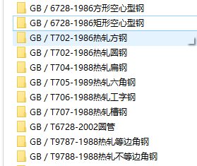

下载以下型材库
链接：https://pan.baidu.com/s/170qEkA8MN5nfCuDD1jZFgg 
提取码：2vyt 

将压缩包解压，SolidWorks安装目录中找到
```BASH
~\SOLIDWORKS\lang\chinese-simplified\weldment profiles
```
在里面新建GB文件夹，将下载的文件复制进去，注意按下图层级复制进去

