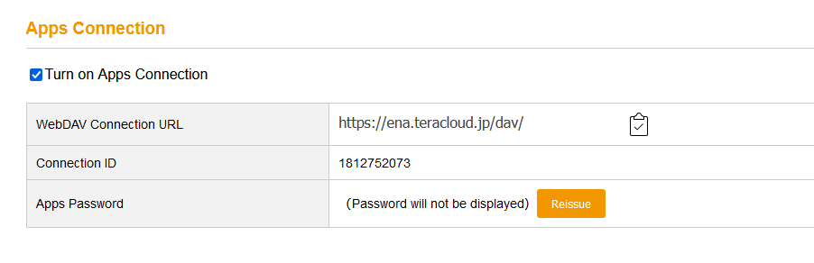
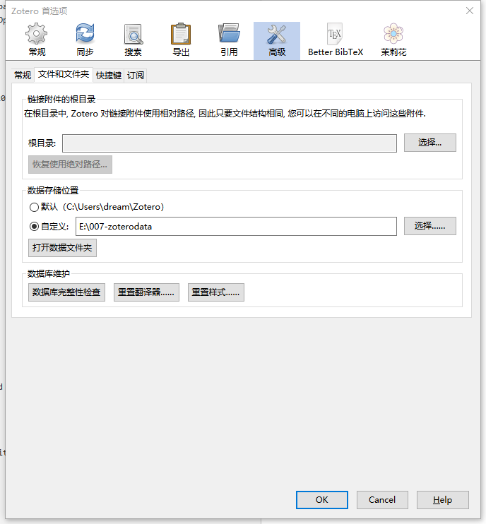
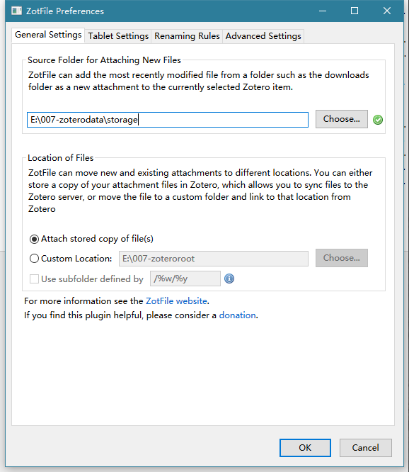

# 1 下载安装

## 1.1 windows：

[Zotero软件](https://www.zotero.org/)

## 1.2 ipad:
​    papership

# 2 安装插件

2.1 [zotfile](http://zotfile.com/)
   + 作用
     + 自动将PDF（或其他文件）重命名，移动和附加到Zotero项目，将PDF从Zotero库同步到您的（移动）PDF阅读器（例如iPad，Android平板电脑等）。 ）并从PDF文件中提取注释。
   + 安装
     + 下载完成后，点击zotero的工具->插件，将下载的插件拖入窗口即可

2.2 Jasminum
2.3 DOI Manager

2.4 [zutilo](https://github.com/wshanks/Zutilo)

# 3 配置Webdav网盘同步

Zotero中的容量较小，所以设置网盘同步，这里选用TeraCloud，有免费的10G+5G空间，理论上比较充足

# 3.1 注册与设置网盘

+ [TeraCloud](https://teracloud.jp/en/)
+ 在My Page界面，找到Apps Connection，如下图，使用Reissue即可生成密码。这个URL和密码要在zotero中用到。
+ 在Zotero中找到：编辑->首选项->同步->文件同步，在使用的下拉框中选择WebDAV
+ 在WebDAV中填入上图中的URL、用户名（ID）、密码，然后选择验证服务器

# 3.2 zotero中的路径设置

+ 编辑->首选项->高级->文件和文件夹
+ 工具->ZotFile Preference
+ 这两个页面的设置，一定要按下图设置，否则在papership中不能打开pdf文件
+ 这样设置完成后，将PDF拖入Zotero后，pdf会自动重命名存储到E:\007-zoterodata\storage

