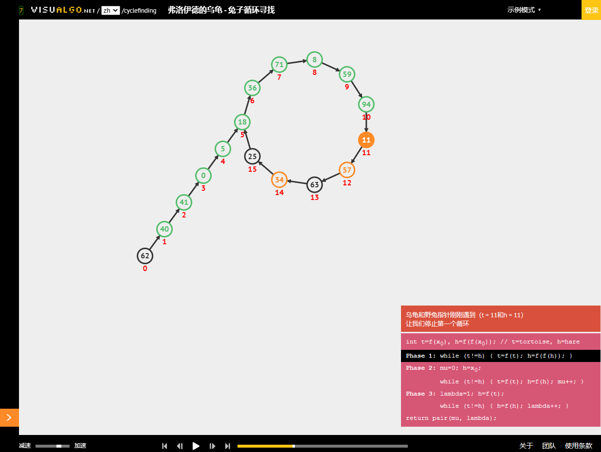

# 题目描述

编写一个算法来判断一个数 n 是不是快乐数。

「快乐数」定义为：

+ 对于一个正整数，每一次将该数替换为它每个位置上的数字的平方和。
+ 然后重复这个过程直到这个数变为 1，也可能是 无限循环 但始终变不到 1。
+ 如果 可以变为  1，那么这个数就是快乐数。
如果 `n` 是快乐数就返回 `true` ；不是，则返回 `false` 。

## 示例1：

```C
输入：19
输出：true
解释：
12 + 92 = 82
82 + 22 = 68
62 + 82 = 100
12 + 02 + 02 = 1
```

## 示例2：

```C
输入：n = 2
输出：false
```

# 解法

## C语言

### 第一种思路

累计相除后取余，得出每一位数
```C

//第一种实现方式
bool isHappy(int n){
    int sum = 0;
    int m = 1;
    for (int k = 1; k <= 10; k++) {
        int d = n / m % 10;

        printf("%d\n", d);
        sum += d * d;

        if (k < 10) {
            m *= 10;
        }
    }

    printf("sum=%d\n", sum);

    return false;
}

//第二种实现
bool isHappy(int n){
    int sum = 0;
    for (int m = 1000000000; m >= 1; m /= 10) {
        int d = n / m % 10;

        printf("%d\n", d);
        sum += d * d;
    }
}

```

### 第二种思路

```C
//    s=12345
//    d = s % 10;   d:5
//    s / 10;       s:1234

//    d = s % 10;   d:4
//    s / 10;       s:123
//    以下内容写入函数

bool isHappy(int n){ 
    while (n != 0) {
        int d = n % 10;
        n /= 10;
        sum += d * d;
    }

    int history[1000];
    int size = 0;
    while (!contains(history, size, n)) {
        history[size] = n;
        size++;

        n = next_n(n);
    }
    return n == 1;
}
```

### 第三种思路

这种思路基于**弗洛伊德的乌龟-兔子循环寻找**。可以在环形链表中找到环形的入口节点。
如下图，一快一慢的龟兔会相继进入一个圈内，当两个点相遇的时候，设置一个从相遇点出发，另一个从起点出发，再次相遇，即为环形入口。

至于更深层次的解释，还没想好怎么表述。

下图的算法图解在https://visualgo.net/en


</br>
</br>

```C

bool isHappy(int n){
    //  龟兔赛跑循环
    int slow = n;
    int fast = n;

    do {
        slow = next_n(slow);
        fast = next_n(next_n(fast));
        //fast = next_n(fast);
    } while (slow != fast);

    return fast == 1;
}
```


